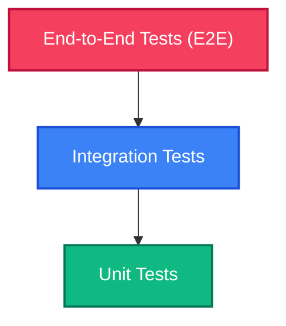

# 🧪 Software Testing Guide: Zero to Hero

Aapka checklist-based guide to understand Software Testing in a simple, practical, and intuitive way!

---

## 🔍 1. Testing Kya Hai? (What is Testing?)

Imagine karo aapne ek **E-commerce Website** banayi hai. Usme ek payment form hai. Jab user buy button dabata hai, toh paise deduct hote hain aur order confirm hota.

* **Manual Testing:** Har baar jab aap code me thoda sa bhi change karoge, aap browser khologe, details bharoge, click karoge, aur check karoge ki sahi kaam ho raha hai ya nahi. Isme **1-2 minutes** lagte hain aur insaan se galti ho sakti hai.
* **Automated Testing:** Aap ek chota sa code (script) likhte ho jo browser open hone ka drama karega, values feed karega, click karega, aur check karega ki page par "Success" message dikha ya nahi. Yeh script **2 seconds** me check karke bata degi!

> [!NOTE]
> **Core Concept:** Test likhna matlab ek automated checklist banana. Jab bhi aap naya code push karoge, yeh checklist khud-ba-khud run hogi. Agar ek bhi point fail hua, toh aapko pata chal jayega ki code me gadbad hai.

---

## ❓ 2. Hum Testing Kyun Karte Hain? (Why do we test?)

Aap soch rahe honge, *"Bina test likhe bhi toh website chal rahi hai, toh extra code kyun likhein?"* Iske kuch bahut bade reasons hain:

1. **Purane Bugs Wapas Aane Se Bachana (Prevents Regressions):** Aapne payment form fix kiya, lekin uske chakkar me login page toot gaya. Automated tests login page ko bhi check karte rahenge, toh aapko turant warning mil jayegi.
2. **Confidence to Refactor:** Jab aap code ko clean ya rewrite karte ho, aapko darr lagta hai ki *"kuch toot na jaye"*. Agar aapke paas solid test suite hai, toh aap bin-dindas changes kar sakte ho. Bas tests run karo aur dekh lo sab green hai.
3. **Time Savings in the Long Run:** Pehli baar me test likhne me thoda time lagta hai, lekin har release par 30 minutes manual testing karne se achha hai ki 5 seconds me automatic test ho jaye.

---

## 📚 3. Types of Testing (Testing Ke Prakar)

Testing ko teen main categories me divide kiya jata hai, jise hum **Testing Pyramid** kehte hain:



Let's look at them in detail:

| Type | Kya Hota Hai? | Real-life Example | Speed & Cost |
| :--- | :--- | :--- | :--- |
| **Unit Testing** | Kisi bhi code ke sabse chote hisse (jaise a single function) ko isolated environment me test karna. | Ek car ke individual components (jaise switch, light bulb, piston) ko separate bench par test karna. | Very Fast, Low Cost |
| **Integration Testing** | Do ya usse zyada modules/units ko mila kar check karna ki wo aapas me sahi coordinate kar rahe hain. | Steering wheel aur wheels ke connection ko test karna. | Medium Speed, Medium Cost |
| **End-to-End (E2E) Testing** | Poore application flow ko start se end tak real user ki tarah simulate karke test karna. | Poori bani hui Car ko crash-test karna ya highway par chala kar test karna. | Slow, High Cost |

---

## 💻 4. Code Example: Manual vs Automated

Chalo ek simple example dekhte hain. Hume ek function banana hai jo cart total calculate karta hai aur discount apply karta hai.

### Humara Code (`cart.js`):
```javascript
// Function to calculate discount
function calculateTotal(price, discountCode) {
  if (discountCode === 'WELCOME10') {
    return price * 0.9; // 10% Off
  }
  return price;
}
```

### Manual Way of Testing 😫
1. Open local server in Chrome.
2. Add an item costing ₹1000.
3. Enter code `WELCOME10`.
4. Manually check if the total displayed is ₹900.
5. Do this for all other codes and edge cases (like negative price, empty code).

### Automated Way using a Test Framework (e.g., Jest) 😍
Hum ek naye file me test likh denge: `cart.test.js`
```javascript
// Humare calculateTotal function ko test file me import karenge
const calculateTotal = require('./cart');

// Unit Test case 1
test('WELCOME10 discount code should apply 10% discount', () => {
  const result = calculateTotal(1000, 'WELCOME10');
  expect(result).toBe(900); // Humara check!
});

// Unit Test case 2
test('Invalid discount code should not change price', () => {
  const result = calculateTotal(1000, 'NO_DISCOUNT');
  expect(result).toBe(1000);
});
```
Ab jab bhi aap terminal me `npm test` chalaoge, output aayega:
```bash
 PASS  ./cart.test.js
  ✓ WELCOME10 discount code should apply 10% discount (2 ms)
  ✓ Invalid discount code should not change price (1 ms)

Test Suites: 1 passed, 1 total
Tests:       2 passed, 2 total
Snapshots:   0 total
Time:        0.15 s
```

---

## 🚀 5. Agla Kadam (Next Steps to Study)

Aapne basic concept samajh liya hai! Ab aap in resources se detailed study kar sakte hain:

1. **Watch "Jest in 100 seconds" by Fireship:** Yeh ek brief visual explanation dega ki Jest framework kaise kaam karta hai.
2. **Watch "What is software testing"** on YouTube (in Hindi/English) to see live manual & automation pipelines in action.
3. **Practice:** Next time jab aap koi validation script ya JavaScript functions likhein, toh sochein ki *agar main iska test likhta, toh wo kaise dikhta?*

---

> [!TIP]
> **Pro Tip:** Jab bhi aap automated tests likhna start karein, pehle easy/small functions ke unit tests se shuru karein (jaise string verification, validation checking, calculations). E2E testing tools jaise **Cypress** ya **Playwright** par baad me move karein!
